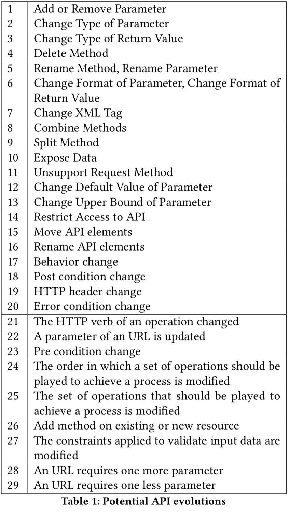

# API Evolutions

This repository contains the documentation of a RESTful API offering lightweight Jira-like project management features.

It illustrates all the possible evolutions of an API according to the following listing:

## Structure

The commit history is used to illustrate evolutions. In addition, the folder [api-versions](./api-versions) contains all versions of the API. One version is created per commit.

The latest version is [openapi.yaml](./openapi.yaml).

## Hints

Places to find ontologies and terms:
- https://lov.linkeddata.es/dataset/lov/terms
- https://schema.org/
- https://www.hydra-cg.com/spec/latest/core/